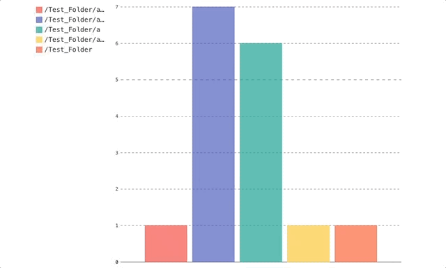

# CODING EXERCISE:

Use advanced scripting language (Python)
Implement a stand-alone script that does the following function.

## Input:

Taking 2 argument:
-  “root_dir” as a root directory to start traversing 
-  “keyword” as a regular expression for example ( “^[a-zA-Z]+_TESTResult.*” ) to detect a file contains a string of interest

## Functionality:
Script should recursively walk the “root_dir” and detect all the files under that dir that contain “keywords”.

For each subdir, script should count the number of file that contain the “keyword"

All results should be saved in a key:value array with key being subdir string, and value being counts of file containing “keyword” in this subdir

## Output:
A output array of all the data, for example {’a/b’: 6, ’a/b/c’: 7, ‘/a/b/c/d’:0}
An output graph with a plot with X as subdir name string, Y as count values. 

## Tests:

Please design a set of tests for the above routine you just wrote, how many ways can break the routine above and how many ways can you test the routine

## How To Use search_keyword.py:

1. Install pygal for the generating the bar chart
    - `pip install pygal`
2. Execute script in terminal
    - `python search_keyword.py [root_dir] [keyword]`
3. Bar Chart will be in the current directory called:
    - `keyword_chart.svg`
    - Chart is generated with pygal with interactive properties

## WAYS TO BREAK THE ROUTINE!
1. If the `root_dir` has any spaces within the path, os will not be able to find path and it will throw an exception.
    - Solution: `replace spaces with "\ "`
2. If search_keyword.py is called within another platform other MacOS concating directory will break. `new_dir = root_dir + "/" + dir`.
    - Solution: To keep the project platform-agnostic I used: `os.path.join(root_dir, dir)`
3. If parameter count is not equal to 3 `search_keyword.py [root_dir] [keyword]`
    - Solution: check `sys.argv length == 3` before executing the remainder of the script

## Testing
1. missing arguments
2. too many arguments
3. non-existent root_dir
4. root_dir that exists
5. test search_keyword is counting properly
6. use regex to check if format of printing is the same format as expected output.
7. test if svg chart is generated